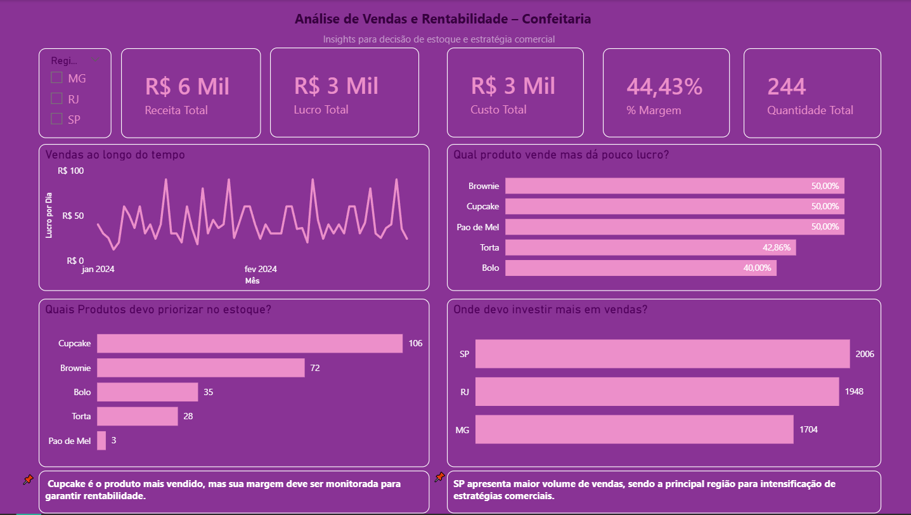

# analise-vendas-confeitaria-powerbi

Análise de Vendas

Projeto desenvolvido com o objetivo de analisar o desempenho de vendas de uma confeitaria, utilizando dados simulados.

Objetivo

Identificar padrões de vendas, produtos mais vendidos e regiões com maior faturamento.

Ferramentas utilizadas
Excel;
Power BI;

Análises realizadas
Receita total, custo e lucro;
Evolução das vendas ao longo do tempo;
Produtos mais vendidos;
Receita por região;

Dashboard

Insights
Produtos como Cupcake lideram em volume de vendas;
A região SP apresenta maior faturamento;
Existe variação de lucro ao longo do tempo;

Sobre mim
Estou em transição de carreira para a área de dados, desenvolvendo projetos práticos com foco em análise de dados e geração de insights para tomada de decisão.
